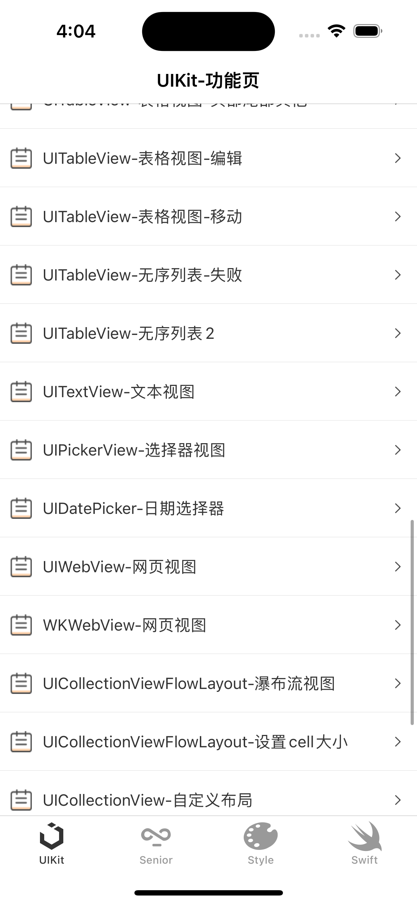
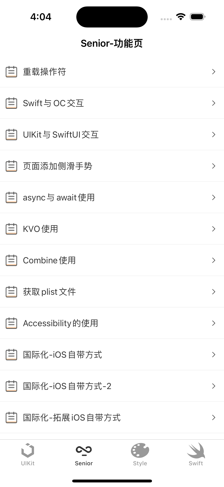
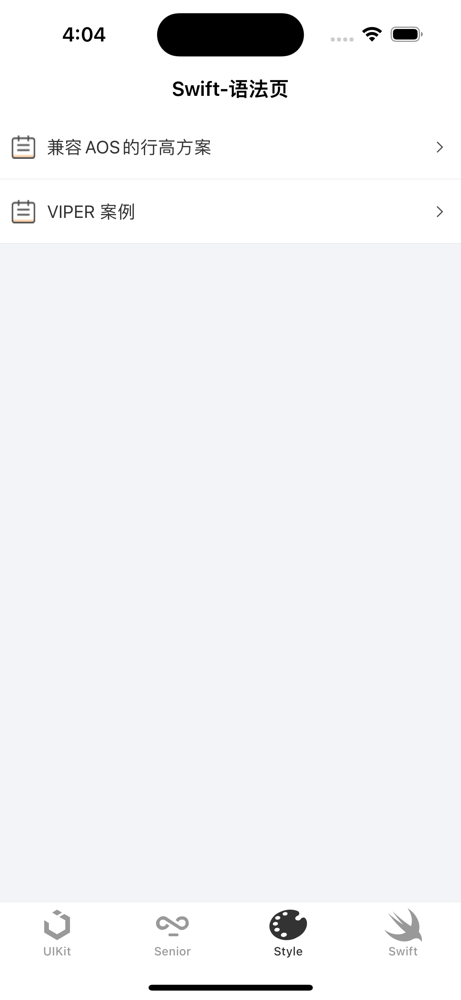

# Web 开发者转 iOS 开发教程 - UIKitDemoAPP 

#### 介绍
UIKitDemoApp for learning UIKit

#### 软件架构
软件架构说明

#### 前提要求
1. 安装 CocoaPods

#### 安装教
1.  pod install
2.  打开 UIKitDemoApp.xcworkspace 项目
3.  运行构建，模拟器选择 iPhone-13 以上

#### 页面效果
<table style="width:100%;table-layout: fixed;">
    <tr>
        <td></td>
        <td></td>
        <td></td>
    </tr>
</table>

#### 参与贡献

1.  Fork 本仓库
2.  新建 Feat_xxx 分支
3.  提交代码
4.  新建 Pull Request

#### 特技

1.  使用 Readme\_XXX.md 来支持不同的语言，例如 Readme\_en.md, Readme\_zh.md
2.  Gitee 官方博客 [blog.gitee.com](https://blog.gitee.com)
3.  你可以 [https://gitee.com/explore](https://gitee.com/explore) 这个地址来了解 Gitee 上的优秀开源项目
4.  [GVP](https://gitee.com/gvp) 全称是 Gitee 最有价值开源项目，是综合评定出的优秀开源项目
5.  Gitee 官方提供的使用手册 [https://gitee.com/help](https://gitee.com/help)
6.  Gitee 封面人物是一档用来展示 Gitee 会员风采的栏目 [https://gitee.com/gitee-stars/](https://gitee.com/gitee-stars/)
